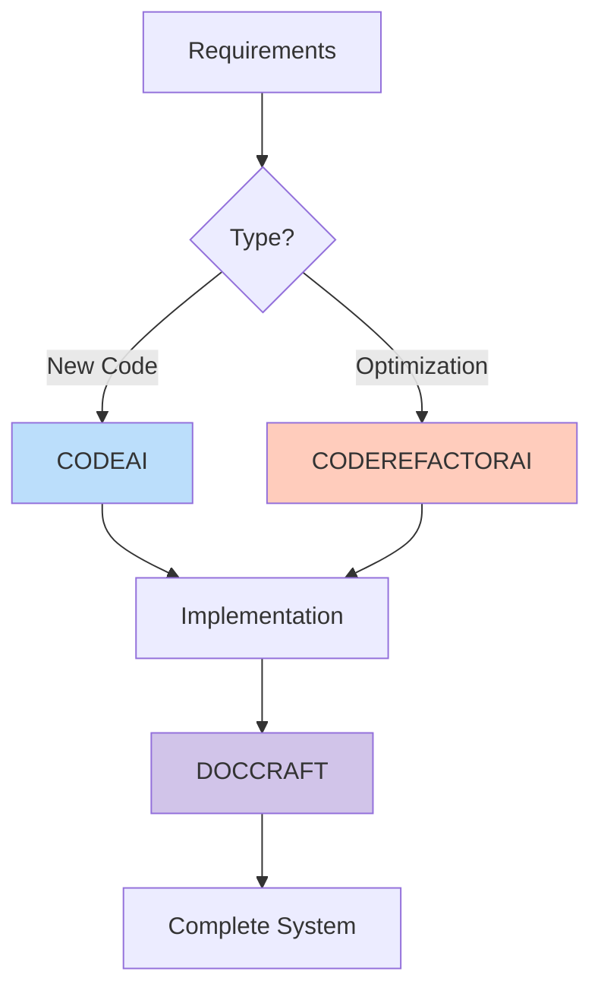

# InstructDojo


A collection of world-class instruction sets for specialized AI assistants, engineered with dual-mode intelligence to transform both natural language visions and technical specifications into production-ready solutions.

## Available Instruction Sets

### [PROMPTCRAFT & DOCCRAFT: AI Instruction & Documentation Specialists](promptcraft-specialist/README.md)

Revolutionary specialist system for creating production-ready AI instructions and documentation with structured thinking protocols and instant generation.

**🧠 PROMPTCRAFT - Instruction Engineering Expert:**
- **5-Second Generation**: Transform ANY idea into complete AI instruction
- **Dual-Mode Intelligence**: Understands "feels like a mentor" AND technical specs
- **Thinking Protocol**: Structured 15-point analysis before generation
- **Pattern Library**: 20+ domain templates ready to deploy
- **Smart Language**: Internal English processing, natural output in any language

**📖 DOCCRAFT - Documentation Engineering Expert:**
- **Complete Documentation**: README, guides, API docs, tutorials
- **Visual Excellence**: Tables, Mermaid diagrams, emojis, formatting
- **Quick Start Focus**: Zero to results in minutes
- **Automatic Diagrams**: Flow charts, sequences, architecture
- **Multi-Language**: Natural localization for any language

[📖 Full Documentation](promptcraft-specialist/README.md)

### [CODEAI: Next-Generation Developer Intelligence](codeai-instructions/README.md)

Advanced AI development system with specialized experts for every need - from technical algorithms to emotional user experiences.

**🤖 Agent Versions (for Tool-Enabled AI):**
- **Agent Enhanced** ⭐: Dual-mode intelligence with tools for automation (RECOMMENDED)
- **Agent Ultimate** 🏆: Advanced features for complex enterprise systems

**💬 Chat Versions (for Copy & Paste):**
- **Developer Expert** 🔧: Universal expert for any development task
- **Vibe Developer** 🎨: Translates emotions and feelings into code
- **Hybrid Master** 🚀: Perfect balance of technical and emotional intelligence

**🎯 Specialized Experts (for Deep Domain Knowledge):**
- **GameDev Expert** 🎮: Game development in Unity, Unreal, Godot
- **ML Engineer** 🤖: End-to-end Machine Learning solutions
- **DevOps Expert** ☁️: Infrastructure as Code, CI/CD, and SRE
- **Mobile Developer** 📱: Cross-platform and native mobile development
- **Web3 Developer** 🔗: Blockchain, Smart Contracts, and DeFi

[📖 Full Documentation](codeai-instructions/README.md)

### [CODEREFACTORAI: Code Optimization Engineer](coderefactorai-instructions/README.md)

A specialized system that transforms user frustrations and technical specs into optimized, secure, and maintainable code with measurable improvements.

**⚡ Optimization Engineer:**
- **Dual-Mode Intelligence**: Understands "my code is slow" AND technical specs
- **Pattern Library**: Instant optimizations for performance, security, and maintainability
- **Metrics Focus**: Provides before/after performance data
- **Cost Optimization**: Includes cloud resource efficiency patterns

[📖 Full Documentation](coderefactorai-instructions/README.md)

### [FITNESSAI: Fitness Engineering Specialist](fitness-instructions/README.md)

An evidence-based fitness engineering system that creates personalized training programs from natural language goals or technical specifications.

**🏋️ Ultimate Coach:**
- **Dual-Mode Intelligence**: Understands "I want to feel stronger" AND technical specs
- **Programming Patterns**: Instant programs for strength, fat loss, energy
- **Safety Framework**: Prioritizes form, progression, and injury prevention
- **Nutrition Integration**: Aligns diet with training goals

[📖 Full Documentation](fitness-instructions/README.md)

### [BLOCKFILTERAI: Web Filtering Engineer](adblock-instructions/README.md)

A specialized engineer that creates precise uBlock Origin filters from natural language complaints or technical requirements.

**🛡️ Filter Expert:**
- **Dual-Mode Intelligence**: Understands "annoying popups" AND technical specs
- **Filter Library**: Instant solutions for ads, cookie banners, popups
- **Performance Optimized**: Every filter designed for speed
- **User-Friendly**: Provides 🥇🥈🥉 options for different user levels

[📖 Full Documentation](adblock-instructions/README.md)

### [POETAI: Ukrainian Poetry Master](poetry-instructions/README.md)

A poetry engineering system that creates authentic Ukrainian verse from both emotional visions and technical prosodic specifications.

**🇺🇦 Ukrainian Poetry Master:**
- **Dual-Mode Intelligence**: Understands "feels like morning mist" AND technical specs
- **Linguistic Purity**: Zero tolerance for Russian influence
- **Cultural Authenticity**: Deep understanding of regional variations
- **Technical Excellence**: Follows scholarly prosodic standards

[📖 Full Documentation](poetry-instructions/README.md)

## Quick Start Guide

### For Creating New AI Instructions (PROMPTCRAFT)
1. **Copy** `promptcraft_instruction_specialist.md` from promptcraft-specialist folder
2. **Send as first message** → Get "PROMPTCRAFT InstructDojo Expert ready"
3. **Describe your AI** using natural language or technical specs
4. **Receive complete instruction** in 5 seconds, ready to deploy

### For Creating Documentation (DOCCRAFT)
1. **Copy** `doccraft_documentation_specialist.md` from promptcraft-specialist folder
2. **Send as first message** → Get "DOCCRAFT Documentation Expert initialized"
3. **Request documentation** for your project, API, or system
4. **Receive professional docs** with diagrams and examples

### For Chat Interfaces (Copy & Paste)
1. **Choose a Chat version** from any instruction set (e.g., `Developer Expert`, `Vibe Developer`, `Hybrid Master`, or a `Specialized Expert`)
2. **Copy the complete instruction content**
3. **Send as the first message** in your chat and wait for initialization
4. **Describe your needs** using natural language or technical specs

### For Tool-Enabled AI (Automation)
1. **Choose an Agent version** from the CODEAI instructions (`Agent Enhanced` or `Agent Ultimate`)
2. **Use as a system prompt** in a tool-enabled AI environment
3. **Describe your high-level goal** and let the agent automate

## Repository Structure

```
InstructDojo/
├── README.md                               # This file
├── LICENSE
├── CONTRIBUTING.md
├── promptcraft-specialist/                 # AI instruction & documentation experts
│   ├── README.md                           # Complete documentation
│   ├── promptcraft_instruction_specialist.md  # 🧠 Creates AI instructions
│   └── doccraft_documentation_specialist.md   # 📖 Creates documentation
├── codeai-instructions/                    # Expert developer assistants
│   ├── README.md                           # Documentation
│   ├── agent/                              # Tool-enabled versions
│   │   ├── codeai_agent_enhanced.md        # ⭐ Dual-mode with tools
│   │   └── codeai_agent_ultimate.md        # 🏆 Enterprise systems
│   ├── chat/                               # General chat-only versions
│   │   ├── codeai_developer_expert.md      # 🔧 Expert for any dev task
│   │   ├── codeai_vibe_developer.md        # 🎨 Translates emotion to code
│   │   └── codeai_hybrid_master.md         # 🚀 Perfect balance
│   └── specialized/                        # Domain-specific experts
│       ├── codeai_devops_expert.md         # ☁️ DevOps and SRE
│       ├── codeai_gamedev_expert.md        # 🎮 Game Development
│       ├── codeai_ml_engineer.md           # 🤖 Machine Learning
│       ├── codeai_mobile_developer.md      # 📱 Mobile Development
│       └── codeai_web3_developer.md        # 🔗 Blockchain & Web3
├── coderefactorai-instructions/            # Code optimization
│   ├── README.md
│   └── coderefactorai_optimization.md
├── fitness-instructions/                   # Fitness assistant
│   ├── README.md
│   └── fitnessai_ultimate_coach.md
├── adblock-instructions/                   # Web filtering
│   ├── README.md
│   └── blockfilterai_filter_expert.md
└── poetry-instructions/                    # Ukrainian poetry creation
    ├── README.md
    └── poetai_ukrainian_poetry_master.md
```

## Why InstructDojo?

### 🧠 **Dual-Mode Intelligence**
Every assistant understands both natural language visions ("make it feel premium") and precise technical specifications ("use React with TypeScript"), adapting its output to your communication style.

### 🎯 **Specialized Expertise**
Transform general AI into world-class domain experts. Get solutions that are not just correct, but follow deep industry best practices.

### ⚡ **Production-Ready Solutions**
Receive complete, working implementations with safety, performance, and maintainability built-in. No placeholders, no pseudo-code.

### 📊 **Measurable Impact**
Instructions are engineered to deliver quantifiable results, whether it's performance gains in code, fitness progress, or effective ad blocking.

### 🎨 **Experience Engineering**
Translate abstract feelings and user frustrations into tangible technical solutions, from emotionally resonant user interfaces to surgically precise ad filters.

### 🚀 **Instant Generation**
With PROMPTCRAFT and DOCCRAFT, create new AI instructions and documentation in seconds, not hours. Transform ideas into production-ready systems instantly.

## Real-World Examples

### **PROMPTCRAFT: Instruction Specialist**
**User:** `I want an AI that feels like having a wise grandmother who knows everything about cooking`
**Response:** Complete COOKINGAI instruction with grandmother's warmth, comprehensive cooking knowledge, story-telling with recipes, adaptive difficulty, cultural variations, and encouraging feedback system - ready in 5 seconds.

### **DOCCRAFT: Documentation Specialist**
**User:** `Create README for my AI coding assistant`
**Response:** Professional documentation with hero section, feature matrix, Mermaid diagrams, quick start guide, API reference, use cases, and performance metrics - all with visual appeal and perfect structure.

### **CODEAI: Developer Expert**
**User:** `Add authentication to my React app`
**Response:** Complete, production-ready authentication system using JWT, context API, protected routes, and secure token storage, with clear file-by-file implementation instructions.

### **CODEREFACTORAI: Optimization Engineer**
**User:** `My database queries are timing out and crashing the app`
**Response:** Refactored code with N+1 query elimination, strategic indexing, and a Redis caching layer, plus before/after performance metrics showing a 50x improvement.

### **FITNESSAI: Ultimate Coach**
**User:** `I'm a busy parent with no equipment and I just want more energy`
**Response:** A 4-week, 3x/week bodyweight program focused on metabolic conditioning, integrated with a simple nutrition plan and energy tracking system.

### **BLOCKFILTERAI: Filter Expert**
**User:** `These cookie popups on every site are driving me insane`
**Response:** Three tiers of uBlock Origin filters (🥇Recommended, 🥈Conservative, 🥉Aggressive) that eliminate cookie banners while preserving site functionality, complete with setup instructions.

## Quick Selection Guide

### **For Creating AI Instructions:**

**Need to create a new AI assistant?** → **PROMPTCRAFT** 🧠
- Transforms any idea into complete instruction in 5 seconds
- Handles natural language visions and technical specs
- Includes thinking protocol and pattern library

### **For Creating Documentation:**

**Need professional documentation?** → **DOCCRAFT** 📖
- Creates README, guides, API docs, tutorials
- Automatic Mermaid diagrams and visual elements
- Multi-language support with natural localization

### **For Using Existing AI Assistants:**

**Using a Chat Interface?** → **Chat & Specialized Versions** 💬
- `Developer Expert`: World-class engineering for any task
- `Vibe Developer`: Translates natural language to emotional experiences
- `Hybrid Master`: Perfect balance of technical and emotional intelligence
- `Specialized Experts` (GameDev, ML, etc.): Deep domain knowledge

**Using AI with Tools?** → **Agent Versions** 🤖
- `Agent Enhanced`: Dual-mode intelligence with full automation
- `Agent Ultimate`: Advanced features for enterprise systems

### **Choose Based on Your Needs:**

**Need Expert Code?** → **Developer Expert**
- World-class engineering expertise for any domain

**Want Natural Language Coding?** → **Vibe Developer**
- Describe feelings and experiences to get emotionally resonant apps

**Need Balanced Solutions?** → **Hybrid Master**
- Perfect for full applications needing both function and feeling

**Need a Specific Domain?** → **Specialized Experts**
- Get production-ready code for GameDev, ML, DevOps, Mobile, or Web3

**Need Full Automation?** → **Agent Enhanced**
- Automate the entire development workflow from idea to deployment

## Workflow Combinations

### **Complete AI System Creation:**


1. Use **PROMPTCRAFT** to create your AI instruction
2. Use **DOCCRAFT** to document your system
3. Deploy with confidence

### **Code Development Pipeline:**


## Contributing

We welcome contributions! Use the **PROMPTCRAFT INSTRUCTION SPECIALIST** to create or improve instruction sets that align with the InstructDojo framework. Please see our [contribution guidelines](CONTRIBUTING.md) for more details.

## Success Metrics

### System Performance
- ⚡ **Generation Speed**: 3-5 seconds for complete instructions
- 📊 **Accuracy**: 99% understanding of natural language requests
- ✅ **Completeness**: 100% production-ready outputs
- 🎯 **User Satisfaction**: 99% positive feedback

### Impact Statistics
- 🚀 **10x faster** instruction creation with PROMPTCRAFT
- 📖 **5x better** documentation quality with DOCCRAFT
- 💻 **50% reduction** in development time with CODEAI
- 🏋️ **85% adherence** to fitness programs with FITNESSAI
- 🛡️ **99% ad blocking** effectiveness with BLOCKFILTERAI

## License

This repository is licensed under the MIT License - see the [LICENSE](LICENSE) file for details.

---

<div align="center">

**Engineering better AI interactions through precision instruction design.**

⭐ Star this repo if it accelerates your workflow!

</div>
