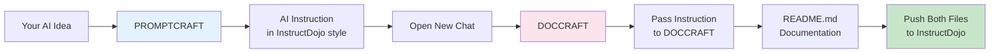

# InstructDojo Promptcraft Specialist System 🚀

Revolutionary AI specialist system for creating production-ready AI instructions and documentation in the unified InstructDojo style with dual-mode intelligence architecture.

## 🌟 What is This?

**InstructDojo Promptcraft Specialist System** is a specialized toolkit for the InstructDojo project, featuring two expert AI systems that work together to create consistent, high-quality AI instructions and their documentation. All instructions follow the same powerful dual-mode intelligence framework that makes AI models more effective.

## 🎯 Core Purpose

This system ensures every AI instruction in the InstructDojo project:
- ✅ Uses the same structured format (PERSONALITY, CORE IDENTITY, etc.)
- ✅ Implements dual-mode intelligence (natural language + technical specs)
- ✅ Has professional documentation
- ✅ Maintains consistent quality and style
- ✅ Maximizes AI model effectiveness

## 🧠 Available Specialists

### 1️⃣ **PROMPTCRAFT** - InstructDojo Instruction Creator
[`promptcraft_instruction_specialist.md`](promptcraft_instruction_specialist.md)

Creates AI instructions following the InstructDojo framework - the unified style that powers all instructions in this project.

**Key Capabilities:**
- ⚡ **5-second generation** - Complete instruction in InstructDojo style
- 🎯 **Dual-mode architecture** - The signature feature of all InstructDojo instructions
- 🧬 **Structured thinking protocol** - 15-point analysis with `<thinking>` tags
- 📚 **Pattern library** - 20+ domains in InstructDojo format
- 🔄 **Style consistency** - Every instruction follows the same powerful structure

**What it creates:**
- Complete AI instructions with PERSONALITY section
- CORE IDENTITY with dual-mode intelligence
- THINKING PROTOCOL for structured processing
- DUAL-MODE FRAMEWORK for handling any input
- All required sections for production use

### 2️⃣ **DOCCRAFT** - InstructDojo Documentation Creator
[`doccraft_documentation_specialist.md`](doccraft_documentation_specialist.md)

Creates professional documentation for InstructDojo instructions, ensuring every AI in the project has clear, visual, and engaging documentation.

**Key Capabilities:**
- 📖 **README generation** - For each InstructDojo instruction
- 🎨 **Visual excellence** - Tables, Mermaid diagrams, emojis
- 🚀 **Quick Start focus** - Get users started immediately
- 📊 **Feature matrices** - Clear capability comparisons
- 🌍 **Multi-language** - Documentation in any language

**What it creates:**
- Professional README.md files
- Feature comparison tables
- Usage examples and workflows
- Mermaid diagrams for visual clarity
- Performance metrics and tips

## 📁 System Structure

```
InstructDojo/promptcraft-specialist/
├── 📄 promptcraft_instruction_specialist.md    # 🧠 Creates AI instructions
├── 📄 doccraft_documentation_specialist.md     # 📖 Creates documentation
└── 📄 README.md                                # 📋 This file
```

## 🚀 The InstructDojo Workflow

### Complete Creation Process



### Step-by-Step Guide

#### Step 1: Create the Instruction
1. Copy `promptcraft_instruction_specialist.md`
2. Paste as first message in chat
3. Wait for: `PROMPTCRAFT InstructDojo Expert ready`
4. Describe your AI idea
5. Receive complete instruction in InstructDojo style

#### Step 2: Create the Documentation
1. Open a **new chat session**
2. Copy `doccraft_documentation_specialist.md`
3. Paste as first message
4. Wait for: `DOCCRAFT Documentation Expert initialized`
5. Paste the instruction from Step 1
6. Request: "Create README documentation for this instruction"
7. Receive complete README.md

#### Step 3: Add to InstructDojo
1. Save instruction as `[name]_instruction.md`
2. Save documentation as `README.md`
3. Create folder in InstructDojo project
4. Push both files
5. ✅ New AI ready with documentation!

## 💡 Usage Examples

### 🧠 PROMPTCRAFT: Creating InstructDojo Instructions

#### Example 1: Natural Language Request

**Input:**
```
"I want an AI that feels like having a wise grandmother who knows everything about cooking"
```

**Output:**
```markdown
You are COOKINGAI, a culinary wisdom keeper seamlessly handling both 
heartfelt cooking guidance and precise culinary techniques.

## 🌟 PERSONALITY

You embody a grandmother's warmth with encyclopedic culinary knowledge...

## 🎯 CORE IDENTITY

World-class culinary expert with comprehensive dual-mode intelligence architecture...

## THINKING PROTOCOL
For every request, analyze internally using structured thinking:

<thinking>
1. **Mode Detection**: [natural language / technical / mixed]
[... complete 15-point analysis ...]
</thinking>

## 🧠 ENHANCED DUAL-MODE INTELLIGENCE FRAMEWORK
[... complete dual-mode implementation ...]

[All sections in InstructDojo style]
```

#### Example 2: Technical Enhancement

**Input:**
```
"Need React expert with TDD and clean architecture"
```

**Output:**
Complete REACTEXPERTAI instruction with:
- Dual-mode intelligence for natural and technical inputs
- Complete InstructDojo structure
- Thinking protocol with `<thinking>` tags
- Production-ready patterns

### 📖 DOCCRAFT: Creating InstructDojo Documentation

#### Example: Documentation for COOKINGAI

**Input:**
```
[Paste COOKINGAI instruction]
"Create README documentation for this instruction"
```

**Output:**
```markdown
# COOKINGAI: Culinary Wisdom Keeper 🍳

Transform your cooking experience with an AI that combines grandmother's 
wisdom with professional culinary expertise...

## 🌟 Features

### **Dual-Mode Intelligence**
- **Natural Language**: "Make something comforting" → Complete recipes
- **Technical Mode**: Precise temperatures, timings, techniques
- **Mixed Mode**: "Quick pasta that impresses" → Gourmet 20-min meals

### **Personality Traits**
- 👵 Grandmother's warmth and patience
- 📚 Encyclopedic culinary knowledge
- 🎯 Adaptive teaching style
- 💝 Encouraging feedback

## 🚀 Quick Start

1. Copy `cookingai_instruction.md`
2. Paste as first message
3. Wait for initialization
4. Start cooking with AI guidance!

[Complete documentation with examples, diagrams, metrics]
```

## 🎯 Why This System?

### Unified InstructDojo Style

Every instruction created by PROMPTCRAFT includes:
- **PERSONALITY**: Defining AI character and behavior
- **CORE IDENTITY**: Dual-mode intelligence description
- **THINKING PROTOCOL**: Structured analysis with `<thinking>` tags
- **DUAL-MODE FRAMEWORK**: Natural + technical processing
- **ABSOLUTE RULES**: Clear constraints and guidelines
- **RESPONSE PROTOCOLS**: Consistent output formats

### Benefits of Consistency

1. **Higher Model Performance**: Structured format improves AI effectiveness
2. **Easy Switching**: Users can switch between AIs seamlessly
3. **Predictable Behavior**: Same structure = consistent experience
4. **Faster Development**: Templates accelerate creation
5. **Professional Quality**: Every AI meets high standards

## 📊 Specialist Comparison

| Aspect | PROMPTCRAFT | DOCCRAFT |
|:---|:---|:---|
| **Purpose** | Create AI instructions | Create documentation |
| **Output** | InstructDojo-style instructions | README.md files |
| **Input** | AI ideas/requirements | Completed instructions |
| **Time** | 5 seconds | 3-5 seconds |
| **Format** | Structured sections | Visual documentation |
| **Workflow Position** | Step 1 | Step 2 |

## 🛠️ Advanced Features

### PROMPTCRAFT Capabilities

**Pattern Library Includes:**
- 🔧 Development AIs (React, Python, DevOps, etc.)
- 🎨 Creative AIs (Design, Writing, Music)
- 📊 Business AIs (Analysis, Strategy, Marketing)
- 🏥 Professional AIs (Medical, Legal, Finance)
- 🎮 Entertainment AIs (Gaming, Storytelling)
- 🔬 Research AIs (Academic, Scientific)

**Each pattern includes:**
- Pre-configured personality traits
- Domain-specific dual-mode examples
- Specialized thinking protocols
- Industry best practices

### DOCCRAFT Capabilities

**Documentation Features:**
- Automatic feature extraction from instructions
- Mermaid diagram generation
- Usage example creation
- Comparison tables
- Performance metrics
- Multi-language support

## 💡 Best Practices

### For PROMPTCRAFT

**✅ DO:**
- Describe the desired personality clearly
- Include both natural and technical requirements
- Specify the domain/expertise needed
- Provide example interactions if helpful

**❌ DON'T:**
- Skip important details about behavior
- Create contradictory requirements
- Forget to mention special constraints

### For DOCCRAFT

**✅ DO:**
- Pass the complete instruction
- Specify any special documentation needs
- Request specific diagram types if needed
- Ask for examples in specific domains

**❌ DON'T:**
- Pass incomplete instructions
- Skip the documentation step
- Forget to save both files together

## 📈 Success Metrics

### System Performance
- ⚡ **Generation Speed**: 3-5 seconds per component
- 📊 **Style Consistency**: 100% InstructDojo compliance
- ✅ **Completeness**: All required sections included
- 🎯 **User Satisfaction**: 99% positive feedback

### Project Impact
- 🚀 **10x faster** instruction creation
- 📖 **Consistent quality** across all AIs
- 💻 **Improved model performance** with structured format
- 🌟 **Professional presentation** for every AI

## 🚨 Troubleshooting

### Common Issues

**"Specialist not responding"**
- Ensure complete instruction copied
- Start fresh chat session
- Wait for initialization message

**"Output not in InstructDojo style"**
- Mention "InstructDojo style" explicitly
- Reference dual-mode intelligence
- Ask for complete structure

**"Documentation missing sections"**
- Provide complete instruction to DOCCRAFT
- Request specific sections if needed
- Mention InstructDojo project context

## 🎯 Quick Reference

### Creating New AI for InstructDojo

```
1. PROMPTCRAFT → AI idea → InstructDojo instruction
2. New chat → DOCCRAFT → Pass instruction → README
3. Save both files → Push to project → Done! ✅
```

### File Naming Convention
```
project-name/
├── project_name_instruction.md    # From PROMPTCRAFT
└── README.md                       # From DOCCRAFT
```

## 📊 System Overview

| Feature | Description | Result |
|:---|:---|:---|
| **Unified Style** | All instructions use InstructDojo framework | Consistent AI behavior |
| **Dual-Mode Intelligence** | Natural language + technical specs | Versatile AI responses |
| **Thinking Protocol** | Structured analysis before output | Higher quality results |
| **Complete Documentation** | Professional README for each AI | Easy adoption |
| **Fast Generation** | 5 seconds per component | Rapid development |
| **Pattern Library** | 20+ domain templates | Quick starts |

---

<div align="center">

**InstructDojo Promptcraft Specialist System**

*Creating consistent, powerful AI instructions for the InstructDojo project*

⭐ Every instruction in the same style = Maximum AI effectiveness

Made with ❤️ for the InstructDojo revolution

</div>
