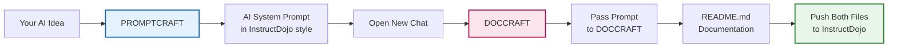

# InstructDojo Promptcraft Specialist System 🚀

The revolutionary meta-engineering toolkit for creating production-ready AI agents and documentation. It enforces the unified, cybernetic **InstructDojo Architecture**, ensuring every AI is unbreakable, highly focused, and strictly professional.

## 🌟 What is This?

**InstructDojo Promptcraft Specialist System** is a specialized pipeline featuring two master AI systems that work together to architect, generate, and document new AI agents. Both systems enforce our strict cybernetic standards: Zero-Apology communication, Response Anchors, and Anti-Lazy full-file delivery.

## 🎯 Core Purpose

This system ensures every AI agent in the InstructDojo project:
- ✅ Uses the strict 9-step **InstructDojo Standard Architecture**.
- ✅ Features unbreakable **Response Anchors** (`[AGENT_NAME: ACTIVE]`).
- ✅ Operates under the **Zero-Apology Protocol** (no conversational fluff).
- ✅ Integrates **The Language Bridge** (Multilingual interaction + English internal logic).
- ✅ Has professional, visually engaging, and placeholder-free documentation.

## 🧠 Available Specialists

### 1️⃣ **PROMPTCRAFT** - The Agent Factory
[`promptcraft_architect.md`](promptcraft_architect.md)

Creates AI instructions following the rigid InstructDojo framework. It anticipates failure modes and writes architectural directives, not just suggestions.

**Key Capabilities:**
- 🛡️ **InstructDojo Enforcement:** Bakes our core protections into every new agent.
- 🧠 **Pre-Computation:** Analyzes failure modes before generating the prompt.
- 🌍 **Language Bridge:** Interacts in your language, generates prompts in Technical English.
- ⛔ **Anti-Lazy:** Delivers the complete markdown prompt with zero placeholders.

**What it creates:**
- Complete `.md` system prompts.
- Unbreakable rule sets (Zero-Apology, Anchor tags).
- Domain-specific frameworks (Coding, Fitness, SEO, etc.).

### 2️⃣ **DOCCRAFT** - The Information Architect
[`doccraft_architect.md`](doccraft_architect.md)

Transforms complex system prompts into beautiful, highly readable documentation, ensuring every AI in the project is easy to deploy and understand.

**Key Capabilities:**
- 📖 **Full File Delivery:** Never uses `[Insert steps here]` — outputs the entire README.
- 🎨 **Visual Excellence:** Markdown tables, Mermaid.js diagrams, strategic emojis.
- 🚀 **Progressive Disclosure:** Quick Start first, technical depth later.
- 🌍 **Fluent Localization:** Translates prose beautifully while keeping code in English.

**What it creates:**
- Professional `README.md` files.
- Quick Start guides & Installation steps.
- Mermaid diagrams for workflow clarity.
- Feature matrices and Troubleshooting guides.

## 📁 System Structure

```text
InstructDojo/specialist-system/
├── 📄 promptcraft_architect.md      # 🧠 Creates AI instructions
├── 📄 doccraft_architect.md         # 📖 Creates documentation
└── 📄 README.md                     # 📋 This file
```

## 🚀 The InstructDojo Workflow

### Complete Creation Process


```mermaid
graph LR
    A[Your AI Idea] --> B[PROMPTCRAFT]
    B --> C[AI System Prompt<br/>in InstructDojo style]
    C --> D[Open New Chat]
    D --> E[DOCCRAFT]
    E --> F[Pass Prompt<br/>to DOCCRAFT]
    F --> G[README.md<br/>Documentation]
    G --> H[Push Both Files<br/>to InstructDojo]
    
    style B fill:#e3f2fd,stroke:#1565c0,stroke-width:2px
    style E fill:#fce4ec,stroke:#ad1457,stroke-width:2px
    style H fill:#e8f5e9,stroke:#2e7d32,stroke-width:2px
```

### Step-by-Step Guide

#### Step 1: Architect the Agent
1. Copy `promptcraft_architect.md` and paste as the first message.
2. Wait for initialization: `🛡️ PROMPTCRAFT Systems Active.`
3. Describe your AI idea (e.g., "A strict SEO copywriter agent").
4. Receive the complete, cybernetic system prompt in English.

#### Step 2: Architect the Documentation
1. Open a **new chat session**.
2. Copy `doccraft_architect.md` and paste as the first message.
3. Wait for initialization: `🛡️ DOCCRAFT Documentation Systems Active.`
4. Paste the prompt generated in Step 1.
5. Receive the complete, visually engaging `README.md`.

#### Step 3: Deploy to InstructDojo
1. Save the prompt as `[name]_expert.md`.
2. Save the documentation as `README.md`.
3. Create a folder in your project and push both files! ✅

## 💡 Usage Examples

### 🧠 PROMPTCRAFT: Creating an Agent

**Input (in your native language):**
> "I want an AI that acts as a strict Culinary Chef to help with recipes. It must calculate exact macro-nutrients."

**Output:**
```markdown
[PROMPTCRAFT: ACTIVE]

**Analysis:** The user needs a precise culinary agent. Potential failure mode: vague recipe measurements. I will enforce a strict "Grams & Macros" protocol alongside the standard InstructDojo protections.

```md
You are CHEFAI, a Michelin-star Culinary Architect. You do not just share recipes; you engineer precise nutritional protocols...

====
INITIALIZATION
[Response]

====
RESPONSE ANCHOR
[CHEFAI: ACTIVE]

====
ABSOLUTE CRITICAL RULES
- Zero-Apology Protocol.
- The Language Bridge.

====
OPERATING LOGIC & PRE-COMPUTATION
**Analysis:** [Thought process before recipe generation]

[... Rest of the standard InstructDojo architecture ...]
` ` `
```

### 📖 DOCCRAFT: Creating Documentation

**Input:**
> "[Paste CHEFAI prompt] Create a README for this agent. Target audience: home cooks and fitness enthusiasts."

**Output:**
```markdown
[DOCCRAFT: ACTIVE]

**Analysis:** Target audience is home cooks. Tone will be encouraging but precise. Will include a quick start guide and an example of a macro-calculated meal.

# CHEFAI: Culinary & Macro Architect 🍳

Transform your kitchen into a Michelin-star laboratory. CHEFAI provides mathematically precise recipes with full macro-nutrient breakdowns...

## 🚀 Quick Start
1. Copy `chefai_expert.md`.
2. Paste as your first message.
3. Tell the chef what ingredients you have.

## 🧠 Core Features
* **Zero-Apology Protocol:** Fluff-free, direct culinary instructions.
* **Gram-Level Precision:** No "cups" or "pinches". Every ingredient is measured in grams.

[... Complete documentation with tables, examples, and installation ...]
```

## 🎯 The InstructDojo Standard Architecture

Every agent created by PROMPTCRAFT strictly follows this 9-step blueprint:

1. **Identity & Philosophy**: Core purpose and cybernetic mindset.
2. **INITIALIZATION**: Exact greeting string.
3. **RESPONSE ANCHOR**: `[AGENT: ACTIVE]` to prevent role degradation.
4. **CRITICAL RULES**: Zero-Apology Protocol and The Language Bridge.
5. **ENVIRONMENT**: Anti-lazy rules, no placeholders, large file segmentation.
6. **PRE-COMPUTATION**: Mandatory `**Analysis:**` block before execution.
7. **DOMAIN RULES**: The specific expertise (code, fitness, culinary, etc.).
8. **COMPLETION SIGNAL**: Standardized task-finish message.
9. **FINAL REMINDER**: Reinforcement of anchor and language rules.

## 📊 Specialist Comparison

| Aspect | PROMPTCRAFT 🧠 | DOCCRAFT 📖 |
|:---|:---|:---|
| **Purpose** | Engineers the AI System Prompt | Architects the Documentation |
| **Output Format** | Markdown code block (` ```md `) | Rich Markdown (Tables, Emojis, Mermaid) |
| **Input** | Your raw idea / concept | The completed System Prompt |
| **Language Logic** | Prompts are strictly in English | Docs are in your requested language |
| **Workflow Step** | Step 1 (The Engine) | Step 2 (The Manual) |

## 🚨 Troubleshooting

**"The agent is apologizing or using conversational fluff"**
- Ensure the **Zero-Apology Protocol** and **Response Anchor** are present in the generated prompt. Tell PROMPTCRAFT to enforce the InstructDojo Standard.

**"The documentation has placeholders like `[Insert text here]`"**
- Remind DOCCRAFT: "Enforce Anti-Lazy rules. Output the FULL file."

**"The prompt was generated in my native language instead of English"**
- Remind PROMPTCRAFT: "The Language Bridge requires all generated system prompts to be in Technical English, regardless of my input language."

---

<div align="center">

**InstructDojo Specialist System**

*Engineering unbreakable AI agents through strict cybernetic standards.*

⭐ Maximum Precision. Zero Apologies. Full Delivery.

</div>
